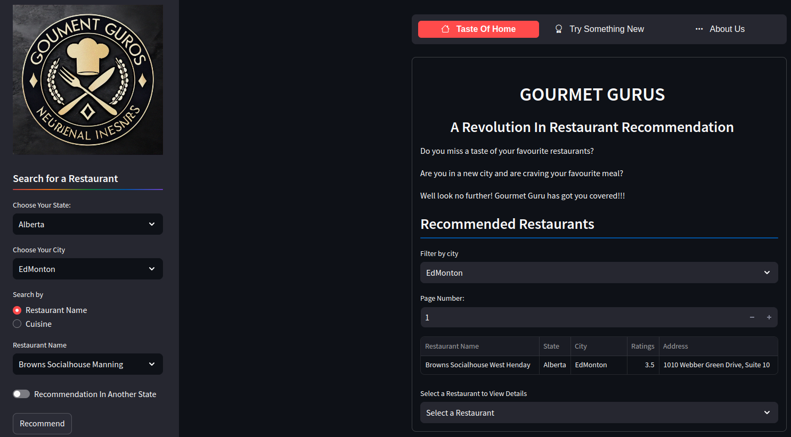

# GOURMET GURU RESTAURANT RECOMMENDER SYSTEM
***



# Introduction

In today's world, where culinary diversity and dining out have become integral to our lives, choosing the right restaurant can be both exciting and overwhelming. With countless options from quaint bistros to exotic eateries, making a dining decision is increasingly challenging.

Traditional restaurant websites use basic filters based on amenities, location, or cuisine types, offering users numerous options to sift through. However, as the restaurant industry evolves, there's a growing need for a more personalized approach to restaurant discovery.

This is where restaurant recommendation systems come in. These advanced systems utilize data science, machine learning, and user preferences to provide tailored dining suggestions that align with individual tastes. By going beyond simple filters, they enhance the dining experience, saving time and offering personalized options that traditional methods cannot match.

This project explores the importance, functionality, and impact of restaurant recommendation systems, highlighting how they are transforming the way we discover and enjoy food. By catering to evolving diner preferences, these intelligent algorithms are revolutionizing the art of restaurant selection, offering a glimpse into the future of dining exploration. Join us as we unravel the potential of these systems in reshaping the culinary landscape.

# Problem Statement
This project aims to address the challenge faced by individuals in making informed choices about restaurants and dining experiences by developing a user-friendly restaurant recommendation system that empowers individuals to make informed dining decisions, ultimately enhancing their overall restaurant experience.

# Main Objective

To develop an interactive and user-friendly restaurant recommendation system.

# Specific Objective
1. **Analyze Key Factors Influencing Restaurant Ratings:** 

2. **Develop Content-Based Recommendation Algorithms:** 

3. **Implement filtering techniques to refine recommendations** 

4. **Create an intuitive, responsive web and mobile application.** 

# Data understanding

The dataset used in this project, was extracted from the Yelp Restaurant [database](https://www.yelp.com/dataset), which is publicly available and contains a large number of reviews across various restaurants and locations. The dataset contains 908,915 tips/reviews by 1,987,897 users on the  131,930 businesses and their attributes like hours, parking, availability, and ambience aggregated check-ins over time for each. The **dataset contains five json files namely business.json, checkin.json, review.json, tips.json and user.json**, but only two files were found to contain the relevant required information;

###  Dataset Column Descriptions
***

| Column Name     | Description                                                                 |
|-----------------|-----------------------------------------------------------------------------|
| review_id       | Unique identifier for the review.                                           |
| user_id         | Unique identifier for the user who wrote the review.                        |
| business_id     | Unique identifier for the business.                                         |
| stars           | Star rating given by the user in the review or the average star rating of the business (typically on a scale of 1 to 5). |
| useful          | Count of how many users found the review useful.                            |
| funny           | Count of how many users found the review funny.                             |
| cool            | Count of how many users found the review cool.                              |
| text            | The content of the review written by the user.                              |
| date            | Date when the review was written.                                           |
| name            | Name of the business.                                                       |
| address         | Street address of the business.                                             |
| city            | City where the business is located.                                         |
| state           | State where the business is located.                                        |
| postal_code     | Postal code (ZIP code) of the business location.                            |
| latitude        | Latitude coordinate of the business location.                               |
| longitude       | Longitude coordinate of the business location.                              |
| review_count    | Number of reviews the business has received.                                |
| is_open         | Indicator of whether the business is currently open (1 = open, 0 = closed). |
| attributes      | Additional attributes of the business (e.g., "WiFi: free", "HasTV: true").  |
| categories      | List of categories the business belongs to (e.g., "Restaurants", "Bars").   |
| hours           | Business hours (e.g., "Monday: 8am-5pm, Tuesday: 8am-5pm").                 |


For download of the dataset's, view the [Link](https://www.yelp.com/dataset) and for complete [documentation](https://www.yelp.com/dataset/documentation/main) of all the datasets.


# Exploratory Data Analysis

Conducting a thorough exploratory data analysis (EDA) is pivotal in crafting an interactive and user-friendly restaurant recommendation system. The analysis delved into critical dataset features, examining the distribution of ratings, categories, and restaurants across cities and states, as well as popular restaurants.

Visualizations, including histograms, box plots, and hexbin plots, were employed for a comprehensive understanding. This EDA offered vital insights, identifying key dataset features. The dataset is primarily composed of food-related establishments, highlighting a diverse range of cuisines. Nightlife venues are also notable, indicating a vibrant nightlife scene. Conversely, fast food and burger establishments are less prevalent in the dataset.


**Observations**
***

- Pennsylvania (PA), Florida (FL), and Tennessee (TN) have the highest concentrations of restaurants, marking them as key markets in the restaurant industry.

- In contrast, there is a clear decline in the number of restaurants as you move from left to right on the graph. States such as North Carolina (NC), Colorado (CO), Hawaii (HI), and Montana (MT) show incomplete data for these regions.

- Recognizing these trends can inform location-based strategies in the restaurant recommendation system, enhancing user experiences and driving business growth.


**Observations**
***

- **66.9% Operational Restaurants:** The majority of restaurants in our dataset are currently open, indicating a strong industry presence with many active establishments available for recommendations.

- **33.1% Closed Restaurants:** A significant portion of the restaurants are no longer operational. This information is vital for enhancing our recommendation system by excluding closed restaurants, which will improve both user experience and system accuracy.

**Strategic Recommendations**
***

To ensure the recommendation system remains accurate, it is essential to regularly update and verify the dataset. This will involve removing closed restaurants from the active list to maintain the reliability and relevance of recommendations.


**Observations**
***

- **Seasonal Patterns:** There are noticeable peaks in customer engagement from April to July, suggesting increased activity during these months.
- **Engagement Decline:** Reviews tend to drop significantly after July, with particular declines observed in September and December.
- **COVID-19 Impact:** A marked decrease in restaurant reviews was recorded in 2020 due to the COVID-19 pandemic.
- **Recommendations for the Recommender System:**
  - Factor in seasonal trends when making recommendations.
  - Adjust timing for promotional activities based on review patterns.

# Data Preparation

In this section, we will perform data cleaning to prepare the dataset for analysis, the various data cleaning methods that are to be used will be;

- Renaming columns
- Checking Dealing with missing data
- Checking and removing duplicates 
- Feature Engineering
- Selecting the Relevant Columns
- Dropping Irrelevant columns
- Selecting relevant rows

# Modelling

In this project, we will concentrate on three specific types of recommendation models:

- Content-Based Recommender Systems


- Collaborative Filtering Systems


- Deep Neural Networks


Within each category, we will evaluate and compare different models to determine which performs the best. For validation and comparison, we will use the RMSE (root mean squared error) metric to measure how closely the predictions align with the actual values.We will pickle our desired data for deployment.

# Content-based Recommendation system

Using the cosine similarity matrix, our content-based recommendation system suggests restaurants to users based on the similarity between restaurant names or specified attributes. This involves comparing user preferences with various restaurants and recommending the top similar options to cater to individual tastes.

# Collaborative filtering

In building a collaborative filtering recommendation system with the Surprise library, we selected relevant columns and initialized a Reader object to format the data. Subsequently, we loaded the data into a Surprise Dataset for further analysis and model creation.
The following steps were taken:
Firstly , we model a baseline SVD() model using the default parameters. The first baseline model had an RMSE of 1.256 same as our best neighborhood-based model which had an RMSE of 1.257. Using the GridSearchCv we will tune the SVD model in order to improve the training RMSE scores.
The SVD collaborative filtering model undergoes hyperparameter tuning through grid search and cross-validation. The optimized model achieves an RMSE of approximately 1.25, signifying good predictive accuracy. The MAE value is around 1.01, indicating improved prediction accuracy. The best hyperparameters include 'n_factors' = 20 and 'reg_all' = 0.05 for RMSE, and 'n_factors' = 20 and 'reg_all' = 0.02 for MAE. These settings make the SVD model well-suited for personalized recommendations based on user ratings.
Finally, the code created initiates an SVD model with tailored hyperparameters, training it on the dataset for personalized user recommendations. To tackle the cold start issue, a function named **restaurant_rater()** engages users to input ratings for specific restaurants. This data is collected for analysis or to support the recommendation system. In scenarios where no user ratings exist, the function seamlessly transitions to the content-based system, effectively addressing the cold start problem.

# Deep - Neural Networks

A deep neural network was also incoperated in the modeling section, where is user and restaurant embeddings/latent factors were multiplied together to predict the user rating which was then passed into a dense connected layers. The model was tunned and regularized to reduce ovefitting and improve validation RMSE scores. 


# Evaluation

Effectively addressing the "cold start problem" is crucial for our model, ensuring meaningful recommendations for new users or restaurants with limited review data. Geographical coverage expansion is also a key metric, with success defined by the model providing relevant recommendations for users across various regions and cities. The successful deployment of our recommendation model is a critical evaluation metric, emphasizing accessibility, responsiveness, and the ability to generate real-time recommendations.

# Conclusions

In conclusion, this project successfully developed an interactive, user-friendly restaurant recommendation system. It provides personalized dining suggestions by considering factors influencing restaurant ratings and user preferences. The advanced recommendation algorithm enhances user experiences with tailored recommendations.

We met key objectives by creating a user-friendly website for easy interaction with the system and analyzing factors affecting ratings and preferences to refine our algorithms. Additionally, we utilized Folium for geographical data visualization, creating interactive maps that reveal geographic trends in restaurant recommendations. This project has achieved its goals, offering a valuable service that enriches users' dining experiences with personalized and location-based recommendations.


# Recommendation

a) Integration of user feedback: 

b) Enhanced user profiles:

c) Enhance recommendation algorithms:

d) Expand geographical coverage:

# Resources

1: For the complete analysis, here is the [Notebook](https://github.com/AtomHarris/Restaurant-Recommendation-System/blob/main/Final%20Notebook.ipynb)

2: The presentation slides are in this [Link](https://github.com/AtomHarris/Restaurant-Recommendation-System/blob/main/Gourment%20Guros%20refined.pptx)

3: The link to the [data report](https://github.com/AtomHarris/Restaurant-Recommendation-System/blob/main/Gourmet%20Guru%20Project%20Report.docx)


## INSTALLATION AND USAGE
1. Clone the repository
    ```sh
    git clone https://github.com/AtomHarris/Restaurant-Recommendation-System.git
    ```
2. Navigate to the project directory
    ```sh
    cd Restaurant-Recommendation-System
    ```
3. Install dependencies
   ```sh
   pip install -r requirements.txt
    ```
4. Execute the app on streamlit
To run the application, execute:
    ```sh
    streamlit run app.py 
    ```


##CONTRIBUTORS
